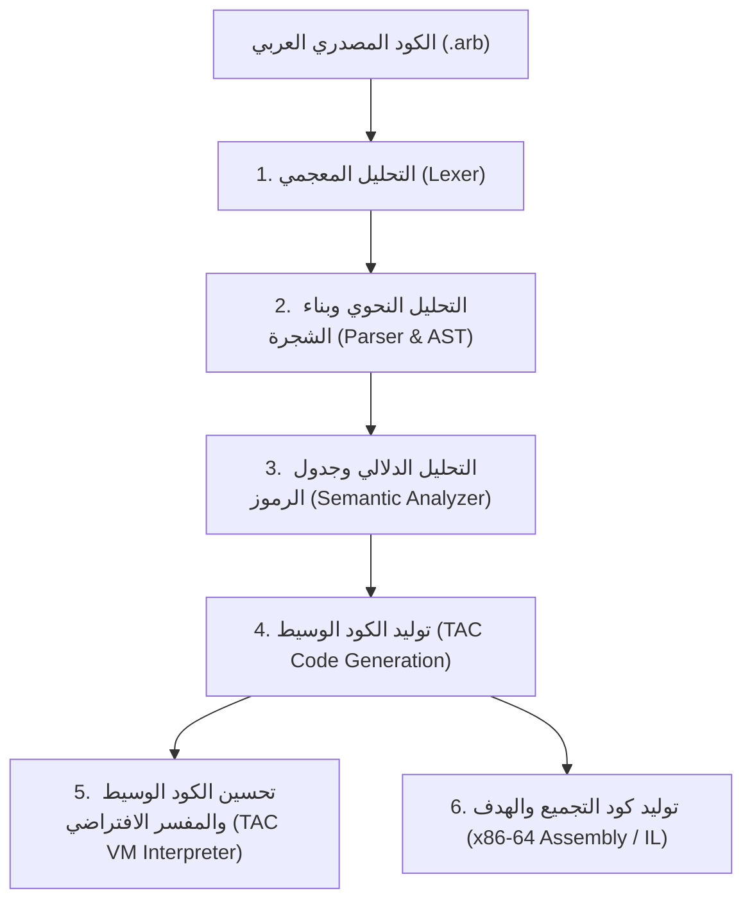

# مترجم ومحرر لغة البرمجة العربية | Arabic Language Compiler & IDE

مترجم متكامل ومحرر كود متطور للغة برمجة مبنية بالكامل باللغة العربية، يدعم مرحلتي البناء بلغة **C++20** الحديثة و **C# (.NET 9.0)** مع واجهة مستخدم رسومية (GUI IDE) تفاعلية.

---

## 🌟 نظرة عامة | Overview

يقدم هذا المشروع بنية كاملة لمترجم متعدد المراحل (Multi-Phase Compiler) مخصص لمعالجة الكود المكتوب باللغة العربية، وتنفيذ التحليل المعجمي والنحوي والدلالي، وتوليد الكود الوسيط (TAC) وتوليد كود التجميع (Assembly x86-64 / MSIL)، بالإضافة إلى بيئة تشغيل ومفسر افتراضي داخلي.

### 🏗️ المكونات الرئيسية للمشروع | Project Components

1. **المترجم الأصلي بلغة C++20 (`CompilerProject_CPP`)**:
   - مبني بالكامل وفق معيار C++20 الحديث.
   - يدعم تشغيل أوامر CLI وتوليد تقارير JSON (`--json`) لتبادل البيانات الفوري مع المحرر.
   - مزود بمجموعة اختبارات آلية متكاملة (26 اختبار تغطي الحالات الإيجابية والسلبية بنجاح 100%).
   - مولد كود أسمبلي x86-64 كامل ومفسر كود وسيط عالي الأداء.

2. **مترجم C# و .NET 9.0 (`CompilerProject`)**:
   - يتضمن معالج التعافي من الأخطاء المتعددة (Panic Mode Error Recovery).
   - توليد كود لغة الآلة وكود MSIL المتوسط.
   - إدارة كاملة لجدول الرموز والتحليل الدلالي لكافة الأنواع النحوية والعمليات الحسابية والمنطقية.

3. **محرر الكود وبيئة التطوير المتكاملة (`LanguageEditor`)**:
   - واجهة مستخدم غنية تدعم الكتابة من اليمين لليسار (RTL) وترقيم الأسطر التلقائي.
   - جدول تفاعلي للأخطاء بأربعة أعمدة: (`#`, `السطر`, `نوع الخطأ`, `التفاصيل`).
   - إمكانية التنقل المباشر وتحديد موضع الخطأ في المحرر بالنقر المزدوج على الصف.
   - تبديل فوري بين محركي الترجمة (C++ و C#).
   - متصفح أمثلة مدمج يستعرض ويحمّل برامج `.arb` التوضيحية بنقرة واحدة.

4. **مكتبة الأمثلة الشاملة (`Examples/`)**:
   - تحتوي على 11 نموذجاً برمجياً متنوعاً يشمل: المتغيرات، الجمل الشرطية، الحلقات التكرارية، المصفوفات، الدوال، العمليات الرياضية والمنطقية، وحساب المضروب والمتوسط الحسابي.

---

## 📐 مراحل المترجم الست | Compiler Architecture Phases



1. **التحليل المعجمي (Lexical Analysis)**: قراءة المحارف العربية وتحويلها إلى رموز مميزة (Tokens) مع تتبع أرقام الأسطر والأعمدة.
2. **التحليل النحوي (Syntax Analysis)**: التحقق من القواعد النحوية وبناء شجرة الإعراب المجردة (AST) باستخدام خوارزمية النزول الانحداري (Recursive Descent Parsing) مع التعافي بالذعر (Panic Mode Recovery).
3. **التحليل الدلالي (Semantic Analysis)**: التحقق من توافق الأنواع، وتصريح المتغيرات، والنطاقات عبر جدول الرموز (Symbol Table).
4. **توليد الكود الوسيط (Intermediate Code Generation)**: تحويل الشجرة إلى تعليمات ثلاثية العناوين (Three-Address Code - TAC).
5. **مفسر الكود الوسيط (TAC Virtual Machine)**: تنفيذ فوري لتعليمات الكود الوسيط وطباعة النتائج والمخرجات.
6. **توليد الكود النهائي (Target Code Generation)**: توليد ملفات التجميع x86-64 / IL للتشغيل المباشر.

---

## 💻 تعليمات البناء والتشغيل | Build & Run Instructions

### المتطلبات المسبقة:
- بيئة Windows (10 / 11)
- مترجم C++ يدعم C++20 (مثل MSVC / Visual Studio 2022 Build Tools أو MinGW-w64 / Clang)
- .NET 9.0 SDK أو .NET 8.0 SDK

### 1. بناء وتشغيل مترجم C++20:
```powershell
cd CompilerProject_CPP
.\build.bat
.\CompilerProject_CPP.exe ..\Examples\01_طباعة_ومتغيرات.arb
```

لتشغيل الاختبارات الآلية الشاملة:
```powershell
.\CompilerProject_CPP.exe --test
```

### 2. بناء وتشغيل مترجم C#:
```powershell
cd CompilerProject
dotnet build -c Release
dotnet run --project CompilerProject.csproj -- ..\Examples\01_طباعة_ومتغيرات.arb
```

### 3. تشغيل محرر الكود الرسومي (GUI IDE):
```powershell
cd LanguageEditor
dotnet run
```

---

## 📁 هيكلية المجلدات | Repository Structure

```
arabic-language-compiler/
├── CompilerProject/               # كود مترجم C# .NET 9.0
│   ├── Lexer/                    # المحلل المعجمي
│   ├── Parser/                   # المحلل النحوي وشجرة AST
│   ├── Semantic/                 # المحلل الدلالي وجدول الرموز
│   ├── IntermediateCode/         # مولد الكود الوسيط ومفسر TAC
│   └── CodeGeneration/           # مولد كود التجميع MSIL / Assembly
├── CompilerProject_CPP/           # كود مترجم C++20 الحديث
│   ├── include/                  # ترويسات C++ (Headers)
│   ├── src/                      # التنفيذ المصدري لجميع المراحل
│   ├── build.bat                 # سكربت البناء السريع عبر MSVC
│   └── CMakeLists.txt            # تكوين CMake للبناء المستقل
├── LanguageEditor/                # واجهة المحرر الرسومية (WinForms IDE)
│   ├── MainForm.cs               # واجهة المستخدم والمحرر
│   └── UIComponents/             # مكوّنات مخصصة لترقيم الأسطر والتنقل
├── Examples/                      # 11 نموذجاً برمجياً باللغة العربية (.arb)
├── تسليم_المشروع_Final_Delivery/  # سكربتات التثبيت وإعداد الحزمة
├── تقرير_المشروع_ودليل_المناقشة_الشامل_RPT.md # التقرير الأكاديمي الشامل
├── قواعد_لغة_البرمجة_العربية.md    # الدليل النحوي للغة العربية
└── README.md                      # هذا الدليل التوضيحي
```

---

## 📜 التوثيق والدلائل | Documentation

- [تقرير المشروع ودليل المناقشة الشامل](تقرير_المشروع_ودليل_المناقشة_الشامل_RPT.md)
- [قواعد لغة البرمجة العربية](قواعد_لغة_البرمجة_العربية.md)

---

## 👥 فريق العمل والمساهمة | Authors & Acknowledgments

تم تطوير هذا المشروع كنموذج متقدم لبناء المترجمات للغات الطبيعية غير اللاتينية، مع دعم التحليل الدلالي والتنفيذ الكامل عبر بيئتين برمجيتين أصليتين.
