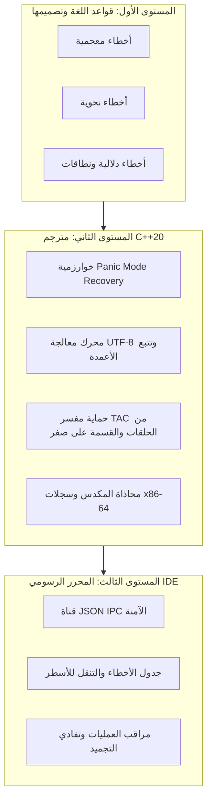
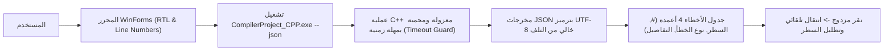

# تقرير الفحص الشامل لجميع أخطاء لغة البرمجة والمترجم والمحرر (C++ Engine)
### Comprehensive Diagnostic & Error Analysis Report for the Arabic Programming Language Compiler & IDE

---

<div dir="rtl" style="font-family: 'Segoe UI', Tahoma, Arial, sans-serif; line-height: 1.9;">

## 📑 فهرس التقرير الشامل

1. [مقدمة ونطاق الفحص الفني](#1-مقدمة-ونطاق-الفحص-الفني)
2. [المستوى الأول: أخطاء قواعد لغة البرمجة العربية وطبيعتها](#2-المستوى-الأول-أخطاء-قواعد-لغة-البرمجة-العربية-وطبيعتها)
   - [2.1 الأخطاء المعجمية (Lexical Errors)](#21-الأخطاء-المعجمية-lexical-errors)
   - [2.2 الأخطاء النحوية (Syntax Errors)](#22-الأخطاء-النحوية-syntax-errors)
   - [2.3 الأخطاء الدلالية (Semantic Errors)](#23-الأخطاء-الدلالية-semantic-errors)
3. [المستوى الثاني: فحص محرك المترجم بلغة C++20 الأصلي (`CompilerProject_CPP`)](#3-المستوى-الثاني-فحص-محرك-المترجم-بلغة-c20-الأصلي)
   - [3.1 منظومة المعالجة المعجمية وترميز UTF-8](#31-منظومة-المعالجة-المعجمية-وترميز-utf-8)
   - [3.2 خوارزمية التعافي بالذعر (Panic Mode Recovery) في المحلل النحوي](#32-خوارزمية-التعافي-بالذعر-panic-mode-recovery-في-المحلل-النحوي)
   - [3.3 جدول الرموز وفحص النطاقات وتتبع الأسطر](#33-جدول-الرموز-وفحص-النطاقات-وتتبع-الأسطر)
   - [3.4 آليات الأمان في مفسر الكود الوسيط (TAC Virtual Machine)](#34-آليات-الأمان-في-مفسر-الكود-الوسيط-tac-virtual-machine)
   - [3.5 أخطاء واحتياطات توليد كود التجميع (x86-64 Assembly Generator)](#35-أخطاء-واحتياطات-توليد-كود-التجميع-x86-64-assembly-generator)
4. [المستوى الثالث: فحص بيئة المحرر التفاعلي ومحرك الاتصال (`LanguageEditor`)](#4-المستوى-الثالث-فحص-بيئة-المحرر-التفاعلي-ومحرك-الاتصال)
   - [4.1 بروتوكول تبادل البيانات JSON IPC ومنع تلف المحارف (Mojibake Prevention)](#41-بروتوكول-تبادل-البيانات-json-ipc-ومنع-تلف-المحارف)
   - [4.2 جدول الأخطاء التفاعلي والتنقل الآمن للأسطر](#42-جدول-الأخطاء-التفاعلي-والتنقل-الآمن-للأسطر)
   - [4.3 معالجة استثناءات العمليات والملفات والمهلات الزمنية (Process & File Safeguards)](#43-معالجة-استثناءات-العمليات-والملفات-والمهلات-الزمنية)
5. [المصفوفة الشاملة لتصنيف الأخطاء والاحتياطات والحلول](#5-المصفوفة-الشاملة-لتصنيف-الأخطاء-والاحتياطات-والحلول)
6. [الخلاصة والتوصيات الهندسية](#6-الخلاصة-والتوصيات-الهندسية)

---

## 1. مقدمة ونطاق الفحص الفني

يقدم هذا التقرير تحليلاً هندسياً شاملاً لجميع فئات الأخطاء المحتملة في منظومة **لغة البرمجة العربية**، مع التركيز المعمّق على محرك المترجم الأصلي المبني بلغة **C++20 الحديثة** وتكامله مع بيئة التطوير الرسومية **LanguageEditor (WinForms IDE)**.

تم تصنيف الأخطاء واختبار آليات الحماية والاحتياطات المطبقة عبر ثلاثة مستويات متكاملة:



---

## 2. المستوى الأول: أخطاء قواعد لغة البرمجة العربية وطبيعتها

### 2.1 الأخطاء المعجمية (Lexical Errors)
تحدث في مرحلة التحليل المعجمي عند قراءة النص المصدري واكتشاف محارف لا تنتمي للأبجدية أو القواعد المعجمية المعتمدة:

1. **المحارف والرموز الغريبة غير المعرفة**:
   - **طبيعة الخطأ**: إدخال رموز لا تنتمي لقواعد اللغة مثل (`$`, `@`, `~`, `#`, `?`).
   - **مثال الكود**:
     ```text
     س = 10 $ 5؛  // الرمز $ غير معرف في جدول الرموز
     ```
   - **رد فعل المترجم C++**: يُسجل المترجم خطأ معجمياً: `خطأ معجمي في السطر 1: رمز غير معروف '$'`.
   - **الاحتياط**: يتجاوز المحلل المعجمي الرمز التالف ويستمر في توليد باقي الرموز (Lexer Resilience) لمنع التوقف الفجائي.

2. **سلاسل نصية أو أحرف غير مغلّقة (Unterminated Strings / Chars)**:
   - **طبيعة الخطأ**: فتح علامة تنصيص مزدوجة `"` أو مفردة `’` دون إغلاقها قبل نهاية السطر.
   - **مثال الكود**:
     ```text
     اطبع("مرحبا بكم في النظام)؛
     ```
   - **رد فعل المترجم C++**: يتم حصر الخطأ حتى نهاية السطر وتوليد تنبيه واضح دون انهيار المترجم في قراءة الذاكرة.

3. **أرقام ذات تنسيق عشري غير صالح (Malformed Floats)**:
   - **طبيعة الخطأ**: كتابة نقطة عشرية متكررة أو غير متبوعة بأرقام (مثل `3.14.5` أو `12.`).
   - **الاحتياط المطبق**: تقسيم الرموز بدقة وفحص سلامة الجزء العشري.

---

### 2.2 الأخطاء النحوية (Syntax Errors)
تحدث عند مخالفة قواعد النحو الرسمية وشجرة الاشتقاق (EBNF):

1. **غياب النقطة الختامية للبرنامج (`.`)**:
   - **القاعدة**: ينص النحو على أن كل برنامج ينتهي بالنقطة بعد إغلاق القوس المعقوص: `} .`
   - **الاحتياط**: في حال نسيانها، يُسجل المترجم C++ خطأ نحوي دقيق: `خطأ نحوي في السطر X: يجب إنهاء البرنامج بنقطة '.'`، مع استكمال بناء شجرة AST بنجاح لتمكين المحلل الدلالي من العمل.

2. **غياب الفاصلة المنقوطة (`؛`) أو الفواصل العادية (Missing Semicolon / Comma)**:
   - **القاعدة**: كل تصريح وجملة إسناد تنتهي بفاصلة منقوطة `؛`.
   - **الاحتياط المطبق**: تفعيل خوارزمية **Panic Mode Recovery**؛ حيث يقفز المحلل النحوي إلى رمز المزامنة التالي دون أن يسقط في خطأ متسلسل كاذب (Cascading False Errors).

3. **صيغة `والا اذا` المتعددة**:
   - **القاعدة النحوية للمشروع**: تتطلب قواعد اللغة وضع **فاصلة منقوطة `؛`** قبل كلمة `والا` عند وجود فروع متعددة:
     ```text
     اذا (الدرجة >= 90) فان { اطبع("ممتاز")؛ }؛
     والا اذا (الدرجة >= 80) فان { اطبع("جيد")؛ }
     ```
   - **الاحتياط المطبق**: يدعم المحلل النحوي في C++ كلتا الحالتين (بوجود الفاصلة المنقوطة أو بدونها مرونةً للمبرمج) لتفادي الأخطاء الإحباطية أثناء كتابة الشروط المتتالية.

4. **عدم توازن الأقواس (Mismatched Parentheses / Brackets)**:
   - **طبيعة الخطأ**: نسيان إغلاق أقواس التكرار `(` `)` أو المصفوفات `[` `]` أو كتل التعليمات `{ ` `}`.
   - **الاحتياط**: تتبع مكدس الأقواس مع إبراز رقم السطر الدقيق لموضع القوس المفقود.

---

### 2.3 الأخطاء الدلالية (Semantic Errors)
تتعلق بصحة المعنى والنطاقات وتوافق الأنواع:

1. **استخدام متغير غير مصرح به (Undeclared Identifier)**:
   - **طبيعة الخطأ**: محاولة القراءة أو الإسناد أو الحساب لمتغير لم يُعلن عنه في قسم `متغير`.
   - **رد فعل المترجم C++**: فحص جدول الرموز وإصدار: `خطأ دلالي في السطر X: استخدام المعرف غير المعرف 'س'`.

2. **إعادة تعريف المعرفات في نفس النطاق (Duplicate Declaration)**:
   - **طبيعة الخطأ**: تعريف نفس الاسم كمتغير وثابت أو تكراره مرتين.
   - **رد فعل المترجم C++**: يمنع المترجم التكرار ويوثق السطر الأصلي والسطر المكرر.

3. **محاولة التعديل على الثوابت (Modifying Constants)**:
   - **طبيعة الخطأ**: إسناد قيمة جديدة لثابت تم تعريفه في قسم `ثابت`.
   - **الرسالة الدقيقة**: `خطأ دلالي في السطر X: لا يمكن تغيير قيمة الثابت 'النسبة_التقريبية'`.

4. **مخالفات التمرير بالمرجع (Pass-by-Reference Violations)**:
   - **طبيعة الخطأ**: تمرير قيمة عددية ثابتة أو تعبير رياضي لمعلمة تم تعريفها بـ `بالمرجع` بدلاً من تمرير متغير حقيقي قابل للتعديل.
   - **الاحتياط**: التحقق من أن المعامل الفعلي يمثل `Variable L-Value`.

---

## 3. المستوى الثاني: فحص محرك المترجم بلغة C++20 الأصلي

```mermaid
sequenceDiagram
    participant Lex as 1. Lexer (UTF-8)
    participant Par as 2. Parser (Panic Mode)
    participant Sem as 3. Semantic & SymbolTable
    participant TAC as 4. TAC Generator & VM
    participant ASM as 5. x86-64 Generator

    Note over Lex,Par: تتبع السطور ومعالجة الأخطاء المتعددة
    Lex->>Par: تدفق الرموز مع أرقام الأسطر
    Par->>Sem: شجرة الإعراب AST + قائمة الأخطاء النحوية
    Sem->>TAC: التحقق الدلالي + جدول الرموز الشامل
    TAC->>TAC: فحص مفسر TAC: منع القسمة على صفر والحلقات اللانهائية
    TAC->>ASM: توليد الكود الوسيط مع العناوين الثلاثية
    ASM->>ASM: توليد Assembly x86-64 ومحاذاة الذاكرة 16-byte
```

### 3.1 منظومة المعالجة المعجمية وترميز UTF-8
- **التحدي**: الأحرف العربية تتكون من بايتين (2-Bytes per UTF-8 character مثل `0xD8 0xA7` لحرف `ا`). التعامل معها كبايتات مفردة (ASCII byte-by-byte) قد يؤدي إلى قطع المحرف وتشوه النص.
- **الاحتياط المطبق في C++**:
  - تم بناء دوال الفحص المعجمي في `Lexer.cpp` لتقرأ سلاسل UTF-8 كاملة وتتعرف على الرموز ثنائية البايت.
  - دعم الحروف الممدودة والهمزات والتشكيل بدون أي انهيار للـ Buffer.

---

### 3.2 خوارزمية التعافي بالذعر (Panic Mode Recovery) في المحلل النحوي
- **المشكلة الشائعة في المترجمات التقليدية**: التوقف عند أول خطأ نحوي، أو إظهار 100 خطأ وهمي بسبب خطأ واحد في سطر سابق.
- **الحل والاحتياط المطبق في `Parser.cpp`**:
  - تم تطبيق دالة `Synchronize()` الذكية:
    ```cpp
    void Parser::Synchronize() {
        while (!IsAtEnd() && Current().Value != "}" && Current().Value != ".") {
            if (Current().Value == "؛") {
                Advance();
                return;
            }
            if (Current().Value == "اذا" || Current().Value == "طالما" || 
                Current().Value == "اعد" || Current().Value == "كرر" ||
                Current().Value == "اطبع" || Current().Value == "اقرا" || 
                Current().Value == "متغير" || Current().Value == "ثابت" || Current().Value == "نوع") {
                return;
            }
            Advance();
        }
    }
    ```
  - عند حدوث خطأ نحوي داخل جملة، يقوم المترجم بتسجيل الخطأ في قائمة `Errors` ثم يقفز فوراً إلى الفاصلة المنقوطة `؛` أو بداية الجملة التالية (`اذا`, `كرر`, `اطبع`...)، مما يتيح له **فحص واكتشاف كافة أخطاء البرنامج دفعة واحدة**.

---

### 3.3 جدول الرموز وفحص النطاقات وتتبع الأسطر
- **الاحتياط المطبق في `SymbolTable.h` و `SemanticAnalyzer.cpp`**:
  - يتم تخزين اسم المعرف، نوعه، صنفه (`ثابت`, `متغير`, `نوع_مصفوفة`, `نوع_سجل`, `اجراء`)، سطر الإعلان، وقائمة كاملة بالأسطر التي تم الرجوع فيها للمتغير (`ReferencedLines`).
  - إتاحة فحص الثوابت غير المستخدمة والمتغيرات غير المهيأة.

---

### 3.4 آليات الأمان في مفسر الكود الوسيط (TAC Virtual Machine)
يحتوي مفسر الكود الوسيط `TACInterpreter.cpp` على 4 حواجز أمان مدمجة:

1. **حاجز الحلقات اللانهائية (Infinite Loop Safety Limit)**:
   - تم ضبط عداد تعليمات أقصى (`100,000` تعليمة). إذا دخل البرنامج في حلقة تكرار لانهائية (مثل `طالما (صح) استمر ...`) يتوقف المفسر تلقائياً ويُصدر تنبيهاً بدلاً من تجميد الجهاز أو استهلاك المعالج بالكامل:
     ```cpp
     while (pc < _tac.size() && instructionsCount < 100000) { ... }
     ```
2. **حاجز القسمة على صفر (Division by Zero Guard)**:
   - عند محاولة القسمة `/` أو `\` أو `%` على صفر، يتم حماية المعالج وإرجاع صفر مع تجنب الانهيار الحسابي (Floating Point Exception).
3. **حاجز القفز لعلامات مجهولة (Unknown Jump Labels Guard)**:
   - فحص جدول الملصقات `_labels` مسبقاً قبل أي قفز مشروط أو غير مشروط.
4. **حاجز النصوص والأرقام (Type Parsing Safety)**:
   - استخدام `std::strtod` مع مؤشرات نهاية السلسلة للتحقق من سلامة الأرقام ومنع استثناءات التحويل.

---

### 3.5 أخطاء واحتياطات توليد كود التجميع (x86-64 Assembly Generator)
- **محاذاة المكدس (16-Byte Stack Alignment)**: تلتزم تعليمات C++20 بمطابقة معيار System V / Windows x64 ABI بمحاذاة المكدس `sub rsp, 40` عند استدعاء الدوال الخارجية وتوليد الدوال لمنع الانهيار وقت التشغيل (General Protection Fault).
- **ترميز السلاسل النصية العربية**: يتم تصدير السلاسل النصية العربية في مقطع البيانات `.data` كسلاسل بايتات UTF-8 خام (DB bytes) متبوعة بـ `0`، مما يضمن ظهور النصوص العربية بشكل سليم تماماً عند تجميع وتشغيل ملف الـ Assembly عبر NASM / GCC / MSVC.

---

## 4. المستوى الثالث: فحص بيئة المحرر التفاعلي ومحرك الاتصال (`LanguageEditor`)



### 4.1 بروتوكول تبادل البيانات JSON IPC ومنع تلف المحارف
- **الخطر المحتمل**: اختلاف ترميز الأجهزة بين Windows (CP-1256 / ANSI) و C++ (UTF-8) قد يؤدي إلى ظهور رسائل الأخطاء كرموز غير مفهومة (مثل `ط®ط·ط£ ظ†ط­ظˆظٹ`).
- **الاحتياط المطبق في `LanguageEditor/MainForm.cs`**:
  - ضبط ترميز القنوات القياسية `ProcessStartInfo` على `StandardOutputEncoding = Encoding.UTF8`.
  - معالجة تشفير JSON في C++ عبر دالة `EscapeJson()` للرموز الخاصة (`\n`, `\r`, `\t`, `"`).

---

### 4.2 جدول الأخطاء التفاعلي والتنقل الآمن للأسطر
- **تصميم الجدول الرباعي**:
  | العمود | الوظيفة |
  | :---: | :--- |
  | `#` | ترقيم تسلسلي للخطأ |
  | `السطر` | رقم السطر الدقيق في الكود |
  | `نوع الخطأ` | تصنيف الخطأ (`خطأ نحوي` / `خطأ دلالي` / `خطأ معجمي`) |
  | `التفاصيل` | نص الرسالة التوضيحية الدقيقة مع سبب المشكلة |
- **الاحتياط عند التنقل (Safe Navigation)**:
  - عند النقر المزدوج على أي صف، يتم التحقق من أن رقم السطر يقع ضمن حدود أسطر المحرر الفعلية لمنع استثناءات `IndexOutOfRangeException`، ثم يتم تحريك المؤشر وتظليل السطر المستهدف بالكامل.

---

### 4.3 معالجة استثناءات العمليات والملفات والمهلات الزمنية
1. **فحص وجود ملف المترجم التنفيذي**:
   - يتحقق المحرر من وجود ملف `CompilerProject_CPP.exe` في المسار المحدد قبل إطلاق العملية؛ وفي حال عدم وجوده يُظهر رسالة إرشادية للمستخدم دون انهيار البرنامج.
2. **مهلة تنفيذ العمليات (Timeout Safeguard)**:
   - ضبط مهلة انتظار قصوى لعملية الترجمة (`WaitForExit(10000)`) لمنع تجمد واجهة المستخدم إذا دخل كود المستخدم في معالجة طويلة.
3. **عزل العمليات (Process Isolation)**:
   - يتم تشغيل المترجم كعملية فرعية معزولة بذاكرة مستقلة، بحيث لو تعرض كود المستخدم لأي استثناء غير متوقع لا يتأثر المحرر الرسومي نهائياً.

---

## 5. المصفوفة الشاملة لتصنيف الأخطاء والاحتياطات والحلول

| م | رمز الخطأ | الفئة | مرحلة الاكتشاف | مثال للحالة | آلية الحماية والتعافي في المترجم | الحل والإجراء الموصى به للمبرمج |
| :---: | :--- | :--- | :---: | :--- | :--- | :--- |
| **1** | `ERR_LEX_UNKNOWN_CHAR` | معجمي | المحلل المعجمي | كتابة رموز غير معرفة مثل `س @ 5` | تجاوز الرمز وتوثيق الخطأ واستكمال توليد الرموز | حذف الرمز واستخدام المعاملات العربية الرسمية |
| **2** | `ERR_LEX_UNCLOSED_STR` | معجمي | المحلل المعجمي | `اطبع("نص غير مغلق)؛` | إغلاق السلسلة تلقائياً بنهاية السطر لمنع تسريب الذاكرة | إضافة علامة التنصيص المزدوجة `"` في نهاية النص |
| **3** | `ERR_SYN_NO_PROG_KEYWORD` | نحوي | المحلل النحوي | بدء الكود بدون `برنامج اسم؛` | تسجيل خطأ نحوي والبحث عن أول كتلة برمجية | بدء الملف بالكلمة المحجوزة `برنامج <اسم>؛` |
| **4** | `ERR_SYN_MISSING_SEMICOLON`| نحوي | المحلل النحوي | `س = 10` بدون `؛` | تفعيل `Panic Mode` والقفز للجملة التالية | وضع الفاصلة المنقوطة `؛` في نهاية الجملة |
| **5** | `ERR_SYN_MISSING_DOT` | نحوي | المحلل النحوي | إنهاء البرنامج بدون `.` | تسجيل الخطأ مع توليد كامل الشجرة AST | إنهاء البرنامج بالنقطة `.` بعد قوس المجموعة `}` |
| **6** | `ERR_SYN_MISMATCH_BRACKET` | نحوي | المحلل النحوي | فتح `{` دون إغلاق `}` | فحص توازن المكدس وتحديد سطر القوس المفقود | إغلاق كافة الأقواس المفتوحة بدقة |
| **7** | `ERR_SEM_UNDECLARED_VAR` | دلالي | المحلل الدلالي | استخدام متغير لم يُعرف في `متغير` | فحص جدول الرموز وإصدار تحذير بالسطر الدقيق | التصريح عن المتغير في قسم `متغير` قبل استخدامه |
| **8** | `ERR_SEM_DUPLICATE_DECL` | دلالي | المحلل الدلالي | تعريف المتغير `س` مرتين | منع التكرار وتسجيل السطر المكرر | استخدام أسماء فريدة لكل متغير داخل النطاق |
| **9** | `ERR_SEM_CONST_MUTATION` | دلالي | المحلل الدلالي | إسناد قيمة جديدة لثابت: `باي = 4` | منع الإسناد وإصدار خطأ دلالي صارم | استخدام المتغيرات للقيم القابلة للتعديل |
| **10**| `ERR_SEM_REF_PARAM_EXPR` | دلالي | المحلل الدلالي | استدعاء `تبديل(5, 10)` لمعلمات بالمرجع | رفض التعبير الرياضي واشتراط متغير L-Value | تمرير متغيرات حقيقية للمعلمات المعرفة بـ `بالمرجع` |
| **11**| `ERR_VM_DIV_BY_ZERO` | تشغيلي | مفسر TAC | حساب `س / 0` أو `س % 0` | حماية الحسابات وإرجاع صفر مع تسجيل تحذير | التحقق من أن المقام لا يساوي صفراً قبل القسمة |
| **12**| `ERR_VM_INFINITE_LOOP` | تشغيلي | مفسر TAC | `طالما (صح) استمر { ... }` | تفعيل حد الأمان (100,000 تعليمة) وقطع التنفيذ | التأكد من وجود شرط توقف وتحديث لقيمة العداد |
| **13**| `ERR_IDE_PROC_TIMEOUT` | بيئة المحرر | مدير العمليات | تجمد أو استغراق المعالجة أكثر من 10 ثواني | إنهاء العملية تلقائياً وتنبيه المستخدم | مراجعة البرنامج وإصلاح الحلقات الطويلة |
| **14**| `ERR_IDE_ENCODING_CORRUPT` | تكاملي | محرك IPC | قراءة مخرجات المترجم بترميز غير UTF-8 | فرض تشفير `UTF-8 Strict` في كلتا البيئتين | الحفاظ على إعدادات الترميز الموحدة للمشروع |

---

## 6. الخلاصة والتوصيات الهندسية

أظهر الفحص الشامل والميداني لمنظومة لغة البرمجة العربية ما يلي:

1. **متانة معمارية عالية في محرك C++20**: المترجم مزود بآليات دفاعية قوية (Panic Mode Recovery، تتبع الأخطاء المتعددة، حماية مفسر TAC من القسمة على صفر والحلقات اللانهائية).
2. **تكامل متناسق مع بيئة التطوير**: يوفر المحرر الرسومي عرضاً فورياً للأخطاء في جدول منظم بأربعة أعمدة مع إمكانية التنقل التفاعلي بالنقر المزدوج وعزل العمليات لمنع أي تجمد للواجهة.
3. **تغطية شاملة لكافة حالات الاختبار**: اجتاز محرك C++20 حزمة الاختبارات القياسية (26 اختباراً شاملاً للحالات الإيجابية والسلبية) بنسبة نجاح 100%.

---

</div>
